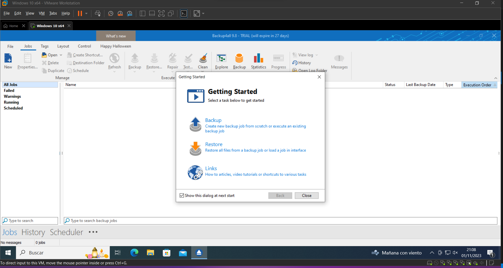
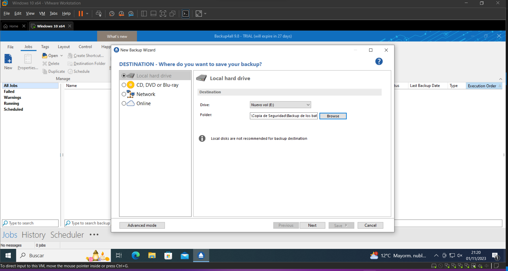
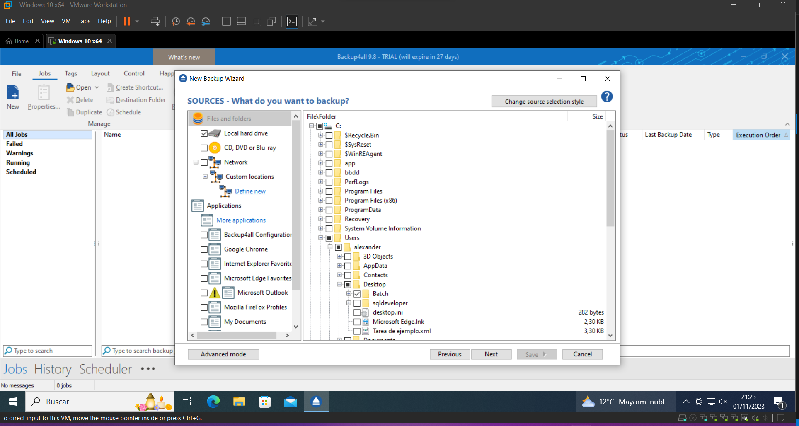
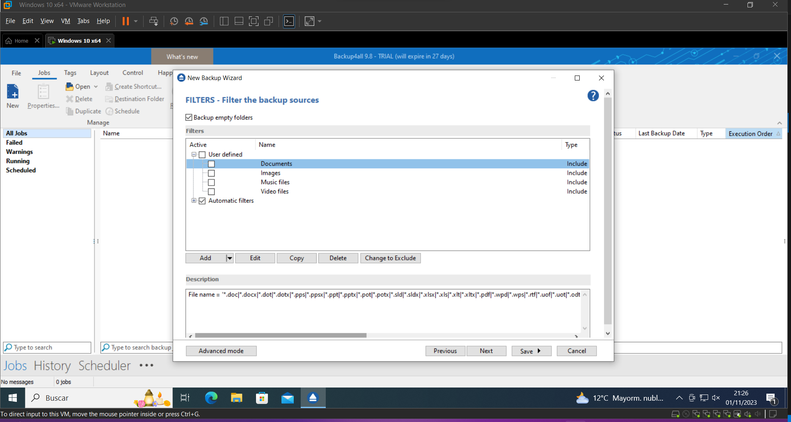
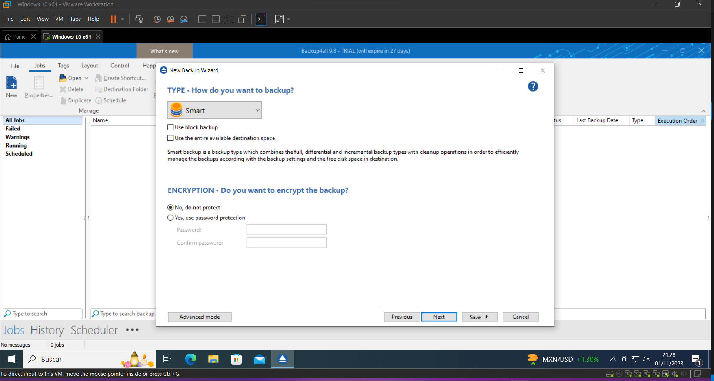
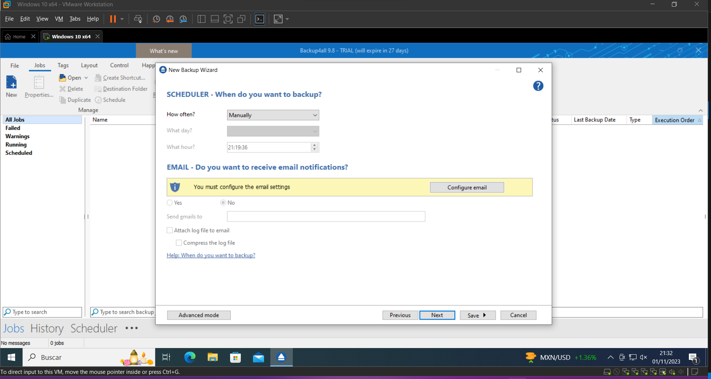
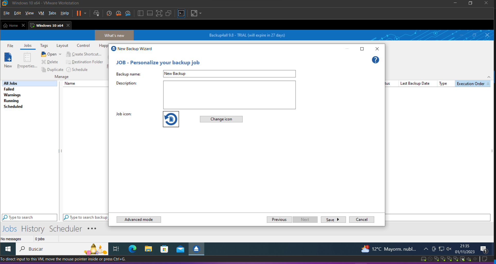
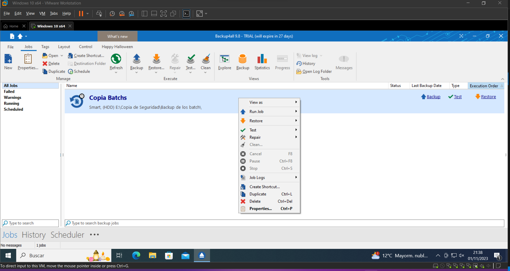
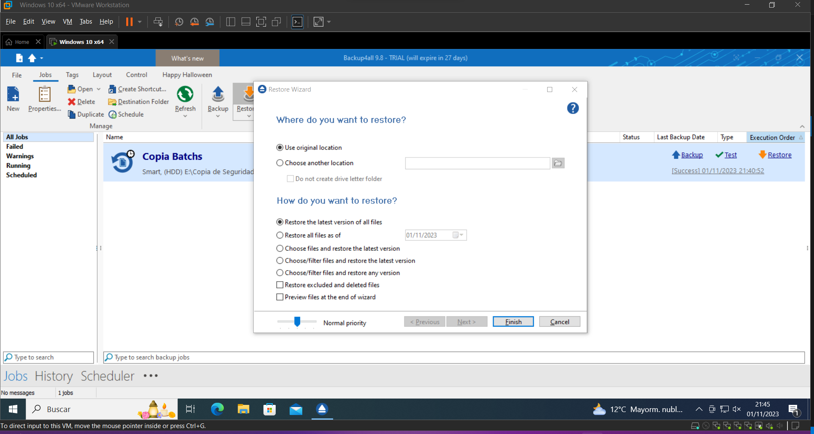
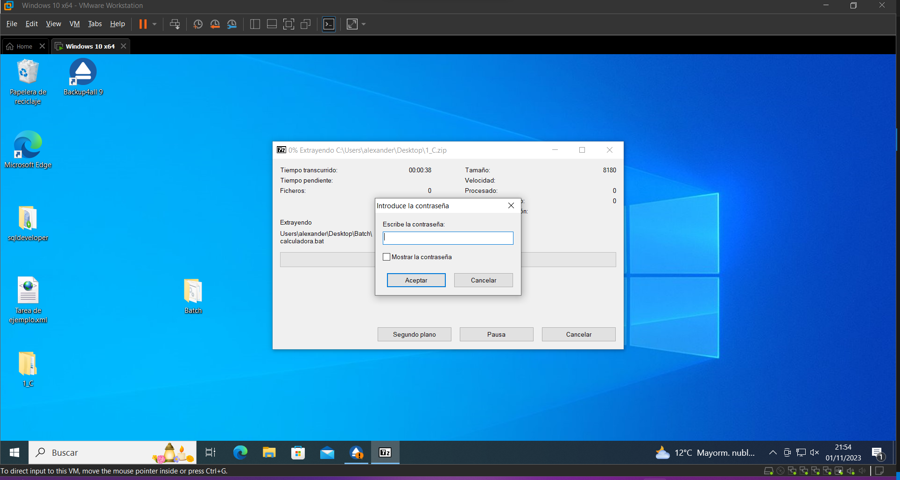

# Actividad 1.- Búsqueda de Información
## Búsqueda de información con el fin de elaborar un diccionario de herramientas mencionadas en este tema, y de aquellos que resulten de la búsqueda de información, en el que se describan los siguientes elementos: descripción, http de descarga y http de tutorial/manual de uso, http de ejemplo de aplicación/uso, otros aspectos.

### FBackup
FBackup es un software gratuito que sirve para hacer copias de seguridad. Permite definir una tarea de respaldo, seleccionar su realización automática, y olvidarte de ella. FBackup realizará automáticamente el respaldo a una hora prefijada.

Cuando se define una tarea de respaldo, puede ser iniciada manualmente presionando el botón Backup (o F6) o, si la se programó, se realizará automáticamente. FBackup puede hacer fácilmente copias de seguridad de orígenes tales como dispositivos locales (incluyendo los que tienen conexión USB), a destinos tales como dispositivos conectados a USB/Firewire, o a ubicaciones de redes mapeadas.

Se crean archivos zip estándar (cuando se usa el tipo de respaldo completo), o copias exactas de las fuentes originales sin compresión (usando el respaldo de tipo espejo). Además, FBackup cuenta con protección contra ransomware.

El programa puede conseguirse en la página oficial: [FBackup](https://es.fbackup.com/fbackup.html)

Aquí se puede encontrar el manual de uso oficial del programa: [FBackup User Manual](https://www.fbackup.com/download/pdf/User-Manual.pdf)

Además, dejo un enlace donde se presenta una pequeña guía de uso: [Cómo Crear Copias de Seguridad con FBackup (Software para PC con Soporte de Backups para Outlook y Navegadores Web)](https://www.hostinet.com/formacion/backups/como-crear-copias-de-seguridad-con-fbackup/)

### AMANDA

AMANDA, que significa Archivador Automático Avanzado de Disco en Red de Maryland (del inglés Advanced Maryland Automatic Network Disk Archiver), es una solución que permite copias de seguridad, pues el administrador de TI es capaz e configurar un único servidor de copia de seguridad maestro para hacer copias de seguridad de múltiples hosts a través de la red a unidades de cinta/cambiadores o discos o medios ópticos.

AMANDA es capaz de realizar copias de seguridad de los datos existentes en una red de ordenadores. Utiliza varios parámetros y configuraciones para determinar el número de copias de seguridad paralelas. Para ello, todas estas configuraciones deben funcionar en conjunto.

Además, AMANDA almacena todas las copias de seguridad importantes, cifradas y comprimidas en el almacenamiento local y servidores de archivos remotos. Esto proporciona una solución poderosa y rentable para la protección de datos.

El programa puede conseguirse en la página oficial: [AMANDA](https://www.amanda.org/)

Aquí se puede encontrar la documentación oficial del programa: [User documentation](https://wiki.zmanda.com/index.php/User_documentation)

Además, dejo un enlace donde se presenta una pequeña guía de uso para Linux: [Amanda - An Advanced Automatic Network Backup Tool For Linux](https://www.tutorialspoint.com/amanda-an-advanced-automatic-network-backup-tool-for-linux)

### Clonezilla

Clonezilla es un programa de clonación e imagen de particiones y discos. Se utiliza para despliegues de sistema, copias de seguridad y recuperación. Cuenta con tres versiones: Clonezilla Live, Clonezilla Lite Server, y Clonezilla SE (Server Edition), siendo la más básica de ellas su versión Live.

Permite clonar sistemas operativos como GNU/Linux, Windows, MacOS u otros, pudiendo arrancar en máquinas BIOS o UEFI, teniendo compatibilidad con formatos de partición MBR y GPT, reinstalación de cargadores de arranque (grub o syslinux), etc. Clonezilla opera a nivel de bloques y puede copiar solo los bloques utilizados en el dispositivo de almacenamiento. En resumen, es una herramienta my útil a la hora implementar sistemas operativos en múltiples computadoras.

El programa puede conseguirse en la página oficial: [Clonezilla](https://clonezilla.org/)

En su misma página web, se puede encontrar la documentación oficial, donde se explica cómo realizar tareas paso a paso: [Clonezilla live doc](https://clonezilla.org//clonezilla-live-doc.php)

Dejo aquí un enlace a una guía en donde se enseña a cómo clonar un disco a otro con la herramienta: [Clona cualquier disco duro o unidad de disco con Clonezilla](https://www.softzone.es/programas/utilidades/copiar-datos-usb-sd-clonezilla/)

### Openfiler

Openfiler es un sistema operativo que proporciona almacenamiento en red adjunto a archivos y almacenamiento de área de red basado en bloques. Basada en la distribución Linux CentOS, se trata de software libre con licencia GNU GPLv2.

Por su naturaleza, tiene un soporte extenso para la gestión de volúmenes y almacenamiento físico. Dentro de sus caracterísitcas más importantes está incluir soporte para volúmenes de partición, ext3, JFS y XFS, el soporte de los protocolos de red NFS, SMB/CIFS, HTTP/WebDAV, FTP y iSCSI así como en el disco nativo de los sistemas de ficheros, de punto en el tiempo de las instantáneas con la programación, las cuotas de asignación de recursos, y una sola interfaz unificada para compartir la gestión que hace la asignación de acciones para varios protocolos de red de sistemas de archivos una forma sencilla.

El SO se puede descargar desde la página oficial: [Openfiler - Downloads](https://www.openfiler.com/community/download)

Openfiler carece de una documentación oficial profunda, pero se pueden encontrar documentaciones muy buenas como esta: [Openfiler Administration Guide](https://juliorestrepo.files.wordpress.com/2010/10/openfiler-administration-guide-_-by-san.pdf)

Dejo aquí una pequeña guía en inglés para montar un NAS con la herramienta: [How to build a network attached storage (NAS) server with Openfiler](https://www.xmodulo.com/how-to-build-network-attached-storage-nas-server-with-openfiler.html)

# Actividad 2.- Búsqueda de Información
## Analiza y describe los sistemas biométricos que actualmente se están utilizando, así como los estudios de implantación de nuevas tecnologías respecto a este campo.

Los sistemas biométricos actuales se utilizan para medir las características biológicas y fisiológicas únicas de los individuos para establecer su identidad. Estos sistemas son capaces de crear y almacenar información acerca de la cara, los dedos y los ojos (iris). A día de hoy están implementados en significativa variedad de ámbitos, por ejeplo:

- En seguridad pública, pues la biometría es utilizada para identificar criminales.
- En controles de migración.
- Identificación civil
- Acceder a hardware personal como ordenadores, móviles, tablets...
- Transacciones financieras

Sin embargo, a medida que la tecnología avanza y el surge la necesidad de mantener las redes y comunicaciones seguras, están saliendo nuevas formas de sistemas biométricos que podrían estandarizarse en un futuro, tales como reconocimiento de voz, monitoreo de freuencia cardíaca, escaneo de vasos intraoculares, escaneo de la forma de los lóbulos de las orejas o incluso reconocimiento por ADN.

Es posible que en el futuro dejemos de lado las contraseñas, para empezar a iniciar sesión utilizando nuestros datos biométricos los cuales se alojarán en la nube. El hecho de que la gran mayoría de la población tenga al menos un dispositivo con acceso a la red ha facilitado la extensión y posibilidad de estos sistemas, los cuales no tardarán en aplicarse cada vez más en nuestro día a día.

# Actividad 3.- Búsqueda de Información
## Analiza el asistente/herramienta de copias de seguridad con el programador de tareas, restauración de las copias de seguridad, puntos de restauración, disco de reparación y reinicio del sistema en reparación/restauración en un entorno Windows 10 o windows  server. Realiza el ejemplo pertinente que muestre la utilización de herramienta.

1. **Copias de seguridad de tareas**:
    El Programador de tareas en Windows 10 permite automatizar tareas, incluida la copia de seguridad de archivos.
    Para hacer una copia de seguridad de una tarea:
    1. Abra el Programador de tareas.
    2. Encuentre una tarea que desee respaldar.
    3. Haga clic derecho en la tarea y seleccione "Exportar" para guardarla como un archivo XML.

    Para restaurar una tarea programada desde una copia de seguridad:
    1. Abra el Programador de tareas.
    2. Seleccione "Importar tarea..." y busque el archivo XML.

2. **Restauración desde copias de seguridad**:
    Windows 10 tiene funciones incorporadas de recuperación. En el panel de control, puede abrirse el menú Recuperación, que brinda dichas funciones.

3. **Puntos de restauración**:
    Restauración del sistema crea puntos de restauración automáticamente o manualmente para revertir a una versión anterior del sistema si ocurren problemas o ataques de malware.
    Para usar un punto de restauración:
    1. Busca "Crear un punto de restauración" en el menú Inicio.
    2. Selecciona el punto de restauración deseado y escanea los programas afectados.

4. **Reparación del disco**:
    Es posible utilizar el comando CHKDSK (Check Disk) para encontrar y reparar problemas en el disco escaneando sectores defectuosos.
    Para usar CHKDSK:
    1. Abra una CMD con permisos de administrador.
    2. Ejecute el comando: `chkdsk /f /r`.

5. **Reinicio del sistema en modo reparación/restauración**:
    Crea una unidad de recuperación para reinstalar Windows 10 en caso de problemas graves.
    Para crear una unidad de recuperación:
        1. Busque "Crear una unidad de recuperación" junto al botón Inicio.
        2. Siga las instrucciones para crearla.

# Actividad 5.-
## Analiza, configura y prueba la herramienta de copia de seguridad Backup4all.
Backup4all es un software de creación y gestión de copias de seguridad que nos permite mantener asegurados nuestros datos personales o de negocio. Se puede descargar en su página oficial, tanto la versión de prueba como la versión por licencia: https://www.backup4all.com/

Una vez descargado e instarlo, nos saldrá esta interfaz (es la versión 9 de prueba, puede variar). Por defecto nos saldrá el menú "Getting Started", con las opciones más básicas que podemos realizar, entre ellos crar una nueva backup, o recuperar a partir de una backup ya creada. En este ejemplo, vamos primero a crear una. Le damos a `Backup` y posteriormente a `Create`.

Nos pedirá que indiquemos dónde queremos guardar a copia de seguridad. Generalmente lo recomendado es que sea en un disco externo al actual. Sin embargo, para hacer esta práctica lo almacenaré en una partición distinta, suponiendo que queremos hacer una copia de seguridad de unos scripts batch que tengo. Indicaré que deseo guardar la copia en el directorio `Backup de los batch` y le daré a `Next`.

Ahora nos preguntará los elementos a los que queremos hacer la copia. Podemos hacerlo tanto a un archivo individual como a un disco entero. Para la práctica, voy abriendo los menús desplegables hasta seleccionar la carpeta `Batch` del escritorio, y le doy a `Next`.

La siguiente ventana que nos sale sirve para indicar si queremos hacer copia o no de determinados tipos de archivos, haciéndonos la tarea de filtrado mucho más amena en el caso de que no queramos hacer un backup de todos los ficheros de un disco, por ejemplo. En mi caso lo dejaré por defecto y sin tocar nada puesto que quiero crear una copia de todos los contenidos de la carpeta. Le doy a  `Next`.

Posteriormente tendremos la posibilidad de elegir el tipo de copia que queremos hacer (Smart, Full, differential, incremental o mirror), además de poder encriptar la copia mediante una contraseña, entre otras opciones. En mi caso seleccionaré un tipo de copia Smart (automaticamente elige qué tipo de copia hacer dependiendo de varios factores) y añadiré protección por contraseña. Le doy a `Next`.

Ahora se nos pregunta cada cuánto querremos hacer copia mediante un scheduler. Podemos elegir manual de modo que solo se haga copia cuando nosotros lo decidamos, o podemos elegir una opción de tiempo para que lo haga automáticamente. También podemos configurar el scheduler para que envíe un email a una dirección cada vez que realiza una copia. Para el ejercicio, indicaré que haga una copia cada día a las 13:00, sin emails. Le doy a `Next`.

Finalmente nos sale una ventana para poner nombre, descripción e icono al job (trabajo), es decir, a la creación/actualización de la copia de seguridad en lso ficheros que hemos configurado. Una vez editados los campos (pongo `Copia Batchs` como nombre), le damos a `Save`.

Hecho esto, ya tenemos el job creado, y tal como lo hemos configurado se ejecutará una vez al día para guardar una copia de seguridad de nuestros ficheros contenidos en la carpeta `Batchs`. Hay muchas opciones que podemos hacer, tales como ejecutar el trabajo (crear/actualizar manualmente la copia), restaurarlo (en caso de que hayamos perdido los archivos originales), testear, reparar, limpiar etc.

Ahora supongamos que hemos perdido los scripts Batch originales, pero por suerte tenemos la copia de seguridad. Para recuperar los ficheros, seleccionamos el Job y le damos a `Restore`.

Nos pregunta si queremos recuperar los ficheros en el mismo directorio donde estaban cuando hicimos la copia de seguridad, además de preguntarnos qué versión de ellos restaurar. Indicaré que use la localización original y la última versión, y le doy a `Finish`. Hecho esto y si ha salido todo bien, tendremos nuestros ficheros de vuelta.

Como curiosidad, los ficheros de la copia de seguridad se guardan en un .zip, y si trato de abrirlos me pide la contraseña que configuramos cuando estábamos haciendo el Job, demostrando que efectivamente están encriptados los datos:

