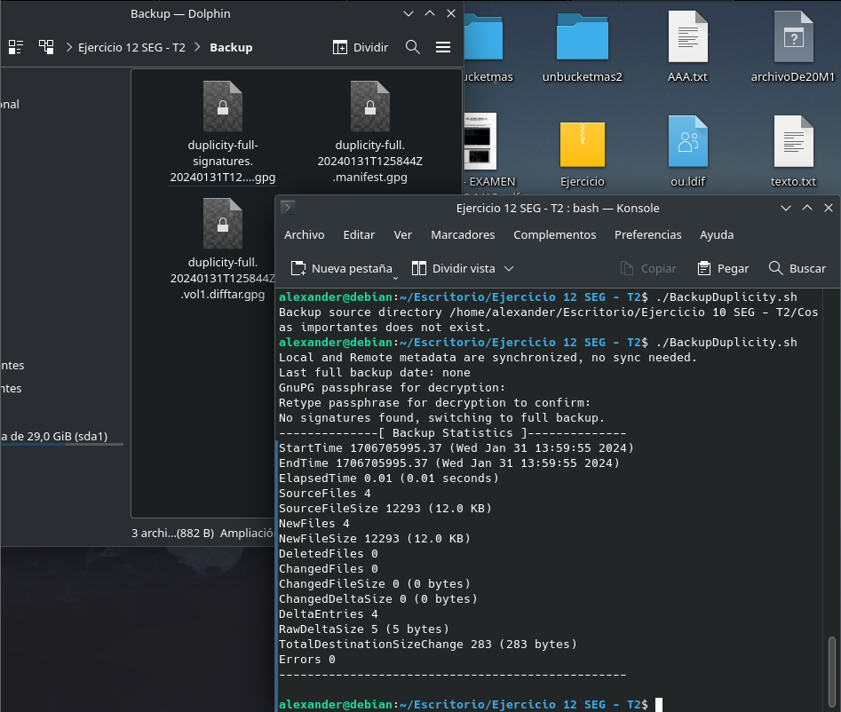
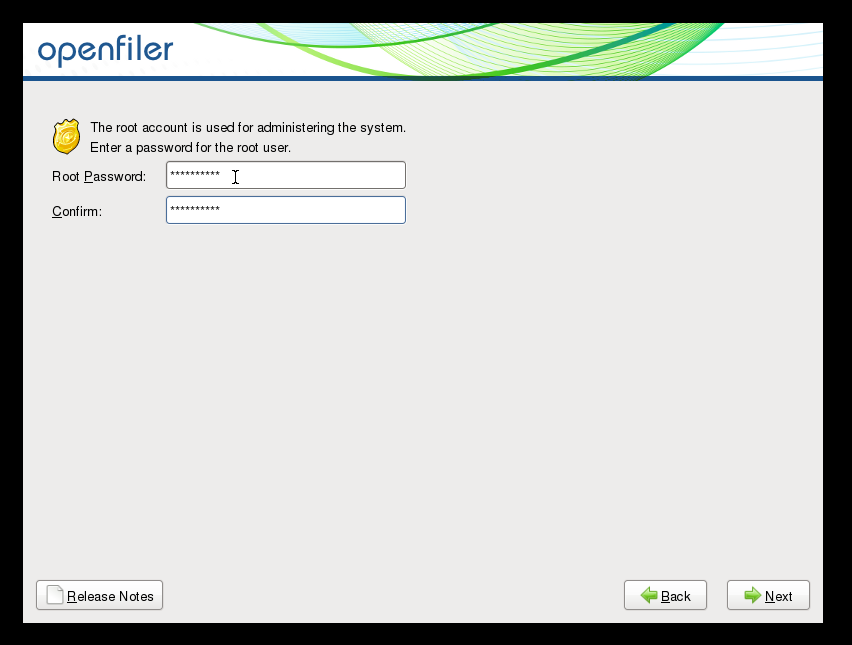

# Actividad 1.- Búsqueda de Información
## Búsqueda de información con el fin de elaborar un diccionario de herramientas mencionadas en este tema, y de aquellos que resulten de la búsqueda de información, en el que se describan los siguientes elementos: descripción, http de descarga y http de tutorial/manual de uso, http de ejemplo de aplicación/uso, otros aspectos.

### FBackup
FBackup es un software gratuito que sirve para hacer copias de seguridad. Permite definir una tarea de respaldo, seleccionar su realización automática, y olvidarte de ella. FBackup realizará automáticamente el respaldo a una hora prefijada.

Cuando se define una tarea de respaldo, puede ser iniciada manualmente presionando el botón Backup (o F6) o, si la se programó, se realizará automáticamente. FBackup puede hacer fácilmente copias de seguridad de orígenes tales como dispositivos locales (incluyendo los que tienen conexión USB), a destinos tales como dispositivos conectados a USB/Firewire, o a ubicaciones de redes mapeadas.

Se crean archivos zip estándar (cuando se usa el tipo de respaldo completo), o copias exactas de las fuentes originales sin compresión (usando el respaldo de tipo espejo). Además, FBackup cuenta con protección contra ransomware.

El programa puede conseguirse en la página oficial: [FBackup](https://es.fbackup.com/fbackup.html)

Aquí se puede encontrar el manual de uso oficial del programa: [FBackup User Manual](https://www.fbackup.com/download/pdf/User-Manual.pdf)

Además, dejo un enlace donde se presenta una pequeña guía de uso: [Cómo Crear Copias de Seguridad con FBackup (Software para PC con Soporte de Backups para Outlook y Navegadores Web)](https://www.hostinet.com/formacion/backups/como-crear-copias-de-seguridad-con-fbackup/)

### AMANDA

AMANDA, que significa Archivador Automático Avanzado de Disco en Red de Maryland (del inglés Advanced Maryland Automatic Network Disk Archiver), es una solución que permite copias de seguridad, pues el administrador de TI es capaz e configurar un único servidor de copia de seguridad maestro para hacer copias de seguridad de múltiples hosts a través de la red a unidades de cinta/cambiadores o discos o medios ópticos.

AMANDA es capaz de realizar copias de seguridad de los datos existentes en una red de ordenadores. Utiliza varios parámetros y configuraciones para determinar el número de copias de seguridad paralelas. Para ello, todas estas configuraciones deben funcionar en conjunto.

Además, AMANDA almacena todas las copias de seguridad importantes, cifradas y comprimidas en el almacenamiento local y servidores de archivos remotos. Esto proporciona una solución poderosa y rentable para la protección de datos.

El programa puede conseguirse en la página oficial: [AMANDA](https://www.amanda.org/)

Aquí se puede encontrar la documentación oficial del programa: [User documentation](https://wiki.zmanda.com/index.php/User_documentation)

Además, dejo un enlace donde se presenta una pequeña guía de uso para Linux: [Amanda - An Advanced Automatic Network Backup Tool For Linux](https://www.tutorialspoint.com/amanda-an-advanced-automatic-network-backup-tool-for-linux)

### Clonezilla

Clonezilla es un programa de clonación e imagen de particiones y discos. Se utiliza para despliegues de sistema, copias de seguridad y recuperación. Cuenta con tres versiones: Clonezilla Live, Clonezilla Lite Server, y Clonezilla SE (Server Edition), siendo la más básica de ellas su versión Live.

Permite clonar sistemas operativos como GNU/Linux, Windows, MacOS u otros, pudiendo arrancar en máquinas BIOS o UEFI, teniendo compatibilidad con formatos de partición MBR y GPT, reinstalación de cargadores de arranque (grub o syslinux), etc. Clonezilla opera a nivel de bloques y puede copiar solo los bloques utilizados en el dispositivo de almacenamiento. En resumen, es una herramienta my útil a la hora implementar sistemas operativos en múltiples computadoras.

El programa puede conseguirse en la página oficial: [Clonezilla](https://clonezilla.org/)

En su misma página web, se puede encontrar la documentación oficial, donde se explica cómo realizar tareas paso a paso: [Clonezilla live doc](https://clonezilla.org//clonezilla-live-doc.php)

Dejo aquí un enlace a una guía en donde se enseña a cómo clonar un disco a otro con la herramienta: [Clona cualquier disco duro o unidad de disco con Clonezilla](https://www.softzone.es/programas/utilidades/copiar-datos-usb-sd-clonezilla/)

### Openfiler

Openfiler es un sistema operativo que proporciona almacenamiento en red adjunto a archivos y almacenamiento de área de red basado en bloques. Basada en la distribución Linux CentOS, se trata de software libre con licencia GNU GPLv2.

Por su naturaleza, tiene un soporte extenso para la gestión de volúmenes y almacenamiento físico. Dentro de sus caracterísitcas más importantes está incluir soporte para volúmenes de partición, ext3, JFS y XFS, el soporte de los protocolos de red NFS, SMB/CIFS, HTTP/WebDAV, FTP y iSCSI así como en el disco nativo de los sistemas de ficheros, de punto en el tiempo de las instantáneas con la programación, las cuotas de asignación de recursos, y una sola interfaz unificada para compartir la gestión que hace la asignación de acciones para varios protocolos de red de sistemas de archivos una forma sencilla.

El SO se puede descargar desde la página oficial: [Openfiler - Downloads](https://www.openfiler.com/community/download)

Openfiler carece de una documentación oficial profunda, pero se pueden encontrar documentaciones muy buenas como esta: [Openfiler Administration Guide](https://juliorestrepo.files.wordpress.com/2010/10/openfiler-administration-guide-_-by-san.pdf)

Dejo aquí una pequeña guía en inglés para montar un NAS con la herramienta: [How to build a network attached storage (NAS) server with Openfiler](https://www.xmodulo.com/how-to-build-network-attached-storage-nas-server-with-openfiler.html)

# Actividad 2.- Búsqueda de Información
## Analiza y describe los sistemas biométricos que actualmente se están utilizando, así como los estudios de implantación de nuevas tecnologías respecto a este campo.

Los sistemas biométricos actuales se utilizan para medir las características biológicas y fisiológicas únicas de los individuos para establecer su identidad. Estos sistemas son capaces de crear y almacenar información acerca de la cara, los dedos y los ojos (iris). A día de hoy están implementados en significativa variedad de ámbitos, por ejeplo:

- En seguridad pública, pues la biometría es utilizada para identificar criminales.
- En controles de migración.
- Identificación civil
- Acceder a hardware personal como ordenadores, móviles, tablets...
- Transacciones financieras

Sin embargo, a medida que la tecnología avanza y el surge la necesidad de mantener las redes y comunicaciones seguras, están saliendo nuevas formas de sistemas biométricos que podrían estandarizarse en un futuro, tales como reconocimiento de voz, monitoreo de freuencia cardíaca, escaneo de vasos intraoculares, escaneo de la forma de los lóbulos de las orejas o incluso reconocimiento por ADN.

Es posible que en el futuro dejemos de lado las contraseñas, para empezar a iniciar sesión utilizando nuestros datos biométricos los cuales se alojarán en la nube. El hecho de que la gran mayoría de la población tenga al menos un dispositivo con acceso a la red ha facilitado la extensión y posibilidad de estos sistemas, los cuales no tardarán en aplicarse cada vez más en nuestro día a día.

# Actividad 3.- Búsqueda de Información
## Analiza el asistente/herramienta de copias de seguridad con el programador de tareas, restauración de las copias de seguridad, puntos de restauración, disco de reparación y reinicio del sistema en reparación/restauración en un entorno Windows 10 o windows  server. Realiza el ejemplo pertinente que muestre la utilización de herramienta.

1. **Copias de seguridad de tareas**:
    El Programador de tareas en Windows 10 permite automatizar tareas, incluida la copia de seguridad de archivos.
    Para hacer una copia de seguridad de una tarea:
    1. Abra el Programador de tareas.
    2. Encuentre una tarea que desee respaldar.
    3. Haga clic derecho en la tarea y seleccione "Exportar" para guardarla como un archivo XML.

    Para restaurar una tarea programada desde una copia de seguridad:
    1. Abra el Programador de tareas.
    2. Seleccione "Importar tarea..." y busque el archivo XML.

2. **Restauración desde copias de seguridad**:
    Windows 10 tiene funciones incorporadas de recuperación. En el panel de control, puede abrirse el menú Recuperación, que brinda dichas funciones.

3. **Puntos de restauración**:
    Restauración del sistema crea puntos de restauración automáticamente o manualmente para revertir a una versión anterior del sistema si ocurren problemas o ataques de malware.
    Para usar un punto de restauración:
    1. Busca "Crear un punto de restauración" en el menú Inicio.
    2. Selecciona el punto de restauración deseado y escanea los programas afectados.

4. **Reparación del disco**:
    Es posible utilizar el comando CHKDSK (Check Disk) para encontrar y reparar problemas en el disco escaneando sectores defectuosos.
    Para usar CHKDSK:
    1. Abra una CMD con permisos de administrador.
    2. Ejecute el comando: `chkdsk /f /r`.

5. **Reinicio del sistema en modo reparación/restauración**:
    Crea una unidad de recuperación para reinstalar Windows 10 en caso de problemas graves.
    Para crear una unidad de recuperación:
        1. Busque "Crear una unidad de recuperación" junto al botón Inicio.
        2. Siga las instrucciones para crearla.

# Actividad 5.-
## Analiza, configura y prueba la herramienta de copia de seguridad Backup4all.
Backup4all es un software de creación y gestión de copias de seguridad que nos permite mantener asegurados nuestros datos personales o de negocio. Se puede descargar en su página oficial, tanto la versión de prueba como la versión por licencia: https://www.backup4all.com/


Una vez descargado e instarlo, nos saldrá esta interfaz (es la versión 9 de prueba, puede variar). Por defecto nos saldrá el menú "Getting Started", con las opciones más básicas que podemos realizar, entre ellos crar una nueva backup, o recuperar a partir de una backup ya creada. En este ejemplo, vamos primero a crear una. Le damos a `Backup` y posteriormente a `Create`.


Nos pedirá que indiquemos dónde queremos guardar a copia de seguridad. Generalmente lo recomendado es que sea en un disco externo al actual. Sin embargo, para hacer esta práctica lo almacenaré en una partición distinta, suponiendo que queremos hacer una copia de seguridad de unos scripts batch que tengo. Indicaré que deseo guardar la copia en el directorio `Backup de los batch` y le daré a `Next`.


Ahora nos preguntará los elementos a los que queremos hacer la copia. Podemos hacerlo tanto a un archivo individual como a un disco entero. Para la práctica, voy abriendo los menús desplegables hasta seleccionar la carpeta `Batch` del escritorio, y le doy a `Next`.


La siguiente ventana que nos sale sirve para indicar si queremos hacer copia o no de determinados tipos de archivos, haciéndonos la tarea de filtrado mucho más amena en el caso de que no queramos hacer un backup de todos los ficheros de un disco, por ejemplo. En mi caso lo dejaré por defecto y sin tocar nada puesto que quiero crear una copia de todos los contenidos de la carpeta. Le doy a  `Next`.


Posteriormente tendremos la posibilidad de elegir el tipo de copia que queremos hacer (Smart, Full, differential, incremental o mirror), además de poder encriptar la copia mediante una contraseña, entre otras opciones. En mi caso seleccionaré un tipo de copia Smart (automaticamente elige qué tipo de copia hacer dependiendo de varios factores) y añadiré protección por contraseña. Le doy a `Next`.


Ahora se nos pregunta cada cuánto querremos hacer copia mediante un scheduler. Podemos elegir manual de modo que solo se haga copia cuando nosotros lo decidamos, o podemos elegir una opción de tiempo para que lo haga automáticamente. También podemos configurar el scheduler para que envíe un email a una dirección cada vez que realiza una copia. Para el ejercicio, indicaré que haga una copia cada día a las 13:00, sin emails. Le doy a `Next`.


Finalmente nos sale una ventana para poner nombre, descripción e icono al job (trabajo), es decir, a la creación/actualización de la copia de seguridad en lso ficheros que hemos configurado. Una vez editados los campos (pongo `Copia Batchs` como nombre), le damos a `Save`.


Hecho esto, ya tenemos el job creado, y tal como lo hemos configurado se ejecutará una vez al día para guardar una copia de seguridad de nuestros ficheros contenidos en la carpeta `Batchs`. Hay muchas opciones que podemos hacer, tales como ejecutar el trabajo (crear/actualizar manualmente la copia), restaurarlo (en caso de que hayamos perdido los archivos originales), testear, reparar, limpiar etc.

Ahora supongamos que hemos perdido los scripts Batch originales, pero por suerte tenemos la copia de seguridad. Para recuperar los ficheros, seleccionamos el Job y le damos a `Restore`.


Nos pregunta si queremos recuperar los ficheros en el mismo directorio donde estaban cuando hicimos la copia de seguridad, además de preguntarnos qué versión de ellos restaurar. Indicaré que use la localización original y la última versión, y le doy a `Finish`. Hecho esto y si ha salido todo bien, tendremos nuestros ficheros de vuelta.

Como curiosidad, los ficheros de la copia de seguridad se guardan en un .zip, y si trato de abrirlos me pide la contraseña que configuramos cuando estábamos haciendo el Job, demostrando que efectivamente están encriptados los datos:


# Actividad 6.-
## Configura y automatiza la copia de seguridad en un entorno linux de una estructura de directorios. Utiliza para ello el comando tar y el servicio crond - consideramos que la copia se realiza en el mismo equipo.

Supongamos que queremos hacer una comia de seguridad diaria de un directorio en el mismo equipo. Para ello tendremos que crear un script (bash) que se encargue de comprimir la estructura de directorio deseada, y que dicho script sea ejecutado diariamente por el demonio crond.

El script bash será un fichero `.sh` básico que contendrá el siguiente código:

```
#!/bin/bash
FECHA=$(date +%Y-%m-%d)
directorio_copia=""
directorio_fuente=""

tar -czf "$directorio_copia/respaldo-$FECHA.tar.gz" "$directorio_fuente"
```
La variable `directorio_copia` especifica la ruta del directorio en donde queremos guardar los ficheros `.tar.gz` (copias de seguridad), mientras que la variable `directorio_fuente` especifica el directorio a respaldar.


Nos aseguramos de que el script sea ejecutable mediante el comando `chmod +x /ruta/al/script.sh`.

Hecho eso ahora tendremos que agregar una nueva línea en nuestro demonio crond. Para ello ejecutamos el comando `crontab -e`. Nos saldrá la opción de poder escribir las entradas que actualmente usan crontab mediante nano o vim. Vamos a añadir la siguiente línea:

```
0 12 * * * /ruta/al/script.sh
```


Salimos del editor y comprobamos con el comando `crontab -l` que nuestra entrada está añadida. De este modo el script se ejecutará automáticamente todos los días a las 12:00 del mediodía, teniendo configurada y automatizada nuestras copias de seguridad.


# Actividades 7 y 9 (complementarias).-
## Configura y automatiza la copia de seguridad en un entorno linux de una estructura de directorios, considerando que la copia se realiza en otro equipo linux/windows (host remote).

Este ejercicio es similar al anterior, con la diferencia de que ahora la copia de seguridad se hace a un equipo externo, no local. Hay varias formas de hacer esto, siendo una de ellas el uso del paquete `rsync`, el cual sirve para transmitir y mantener sincronizados ficheros y directorios a través de la red mediante ssh.

El script que tendremos será este:

```
#!/bin/bash
directorio_origen="/ruta/del/directorio/de/origen"
directorio_destino="usuario@ip_del_host_remoto:/ruta/del/directorio/de/destino/"

sshpass -p "contraseña_usuario_ssh" rsync -avz "$directorio_origen" "$directorio_destino"
```


La variable `directorio_origen` especifica la ruta del directorio del que queremos hacer una copia, mientras que la variable `directorio_destino` especifica el directorio donde va a ser copiado (sincronizado) en el host externo especificando tanto la dirección IP como el usuario. La utilidad `sshpass` sirve para que la conexión ssh se produzca de forma automática introduciendo la contraseña contenida en el script.

Ejecutamos el comando `chmod +x /ruta/al/script.sh`, y luego el comando `crontab -e` seleccionado el editor nano para añadir la siguiente línea:

```
0 14 * * * /ruta/al/script.sh
```


Al salir podemos utilizar el comando `crontab -l` para comprobar que la línea se ha añadido exitosamente. Ahora cada vez que sea las 2 de la tarde el script se ejecutará automáticamente, creando la copia de seguridad en el host externo.

# Actividad 10.-
## Configura y automatiza la copia de seguridad en un entorno linux de una estructura de directorios. Utiliza para ello el comando dd y el servicio crond - consideramos que la copia se realiza en el mismo equipo. Considerar además distintos programas de copia, cada uno de ellos con sus correspondientes momentos.

El comando dd (Data Duplicator) es un comando Linux de bajo nivel que permite realizar copias de seguridad y clonar ficheros, discos y particiones, permitiendo configuraciones avanzadas. Es bastante útil y usado debido a su potencia y flexibilidad.

Teniendo en cuenta que la copia se hará en el mismo equipo de forma diaria procederemos a crear un script `.sh`, el cual lo añadiremos al servicio crontab.

Este es un ejemplo real de script bash que puede servir:

```
#!/bin/bash
fic_origen="/ruta/al/fichero"
dir_destino="/ruta/a/la/copia"

archivo_backup="backup_$(date +%Y%m%d).img"

dd if=$fic_origen of=$dir_destino/$archivo_backup
```

Este script realiza una copia de seguridad del archivo especificado en `fic_origen` y lo guarda como una imagen de disco en `dir_destino`. DD normalmente no acepta directorios convencionales, y aunque hay maneras de circunvalar esa restricción, es mejor usar otros comandos tales como rsync o cp.


Al igual que en el ejercicio anterior, ejecutaremos el comando `chmod +x /ruta/al/script.sh`, y luego el comando `crontab -e` seleccionado el editor nano para añadir la siguiente línea:

```
0 14 * * * /ruta/al/script.sh
```
Una vez hecho esto, se hará una copia de seguridad del fichero que hagamos seleccionado una vez al día a las dos de la tarde.

# Actividad 12.-
## Configura y automatiza la copia de seguridad en un entorno linux de una estructura de directorios. Utiliza para ello el comando duplicity y el servicio crond– consideramos que la copia se realiza en el mismo equipo.

Duplicity es una herramienta avanzada de copias de seguridad, disponible en la línea de comandos. Está escrita en Python, usando herramientas como librsync y GnuPG. Los archivos obtenidos se suelen encontrar en formato tar y, si lo creemos oportuno, pueden estar cifrados. También soporta la sincronización de archivos localmente entre sistemas de archivos, SSH/SCP, rsync, FTP, WebDAV, Tahoe-LAFS, y Amazon S3, entre otros.

Usarlo es muy sencillo, y es que un script simple como el siguiente es suficiente para hacerlo funcionar:

```
#!/bin/bash
directorio_origen="/ruta/del/directorio/de/origen"
directorio_destino="/ruta/del/directorio/de/destino"

duplicity "$directorio_origen" file://$directorio_destino
```
Establecemos el directorio que queremos respaldar con la variable `directorio_origen` y el directorio donde queremos que se guarden los respaldos con la variable `directorio_destino`. Luego escribimos el comando de duplicity para que se realice el proceso.



Como se puede apreciar en la imágen, se realiza la copia encriotada por defecto, creándose en este caso 3 archivos con la extensión `.gpg` (tendremos que propiciar una passphrase antes de realizar la copia).

Hecho esto, ahora programaremos su ejecución. Ejecutaremos el comando `chmod +x /ruta/al/script.sh`, y luego el comando `crontab -e` seleccionado el editor nano para añadir la siguiente línea:

```
0 14 * * * /ruta/al/script.sh
```
Una vez hecho esto, se realizará una copia de seguridad diaria y encriptada a las dos de la tarde del directorio que hayamos elegido bajo el comando duplicity.

# Actividad 13.-
## Realiza un Manual de “El planificador de tareas de Linux”. Se incorporará las referencias, ejemplos, recursos multimedia, … necesarios que junto al material elaborado de una guía útil de esta herramienta.

Hace unos pocos años escribí un minimanual sobre las formas que tenemos los administradores de linux para programar tareas, así que dejo el enlace del PDF subido al Drive para que se le eche un vistazo:

[Enlace al documento Drive de programación de tareas en Linux](https://drive.google.com/file/d/1slKXnp07PIJ2rsgwaLqaeDwNfSF16_-z/view?usp=sharing)

# Actividad 14.-
## Explica y ejercita las opciones más importantes de la herramienta de clonación Clonezilla. Considera que la clonación se realiza en el mismo equipo. Realiza la restauración con el fin de comprobar el proceso realizado.

Clonezilla es un software libre de recuperación de una imagen creada de un sistema operativo. Por tanto, está diseñado para copiar o clonar un disco duro o un dispositivo de almacenamiento de datos similar para una fácil restauración de un sistema averiado.

Cuando booteamos un dispositivo con la ISO de Clonezilla Live nos saldrá esta pantalla por primera vez, donde se nos pedirá un idioma (eligiremos español):


Posteriormente nos pregunta si queremos cambiar la distribución de teclado a esa lengua. Le daremos que sí, `change`:


Luego nos pregunta por la distribución de teclas y de teclado. En la mayoría de casos seleccionaremos `PC genérico de 105 teclas` y todas las opciones para ponerlo en castellano:


Finalmente, tras introducir varios valores de lenguaje y distribuciones, nos saldrá un menú que nos diga si queremos iniciar Clonezilla o la shell. Eligiremos Clonezilla (`Start Clonezilla`) pues es más fácil de usar:


La siguiente pantalla que nos sale es muy importante, pues nos muestra las opciones principales que tenemos para usar Clonezilla. En la captura se muestra claramente, pero básicamente tenemos opciones device-image y device-device. La primera significa guardar disco/partición a imágen o restaurar imágen a disco/partición, mientras que la segunda significa disco a disco o partición a partición clonada (sin imágenes de por medio). El resto de opciones son para dispositivos remotos y para tipos de Clonezilla especiales.

Si suponemos que, por ejemplo, queremos hacer una copia de seguridad de un disco a una imágen, seleccionaremos entonces `device-image`.


A continuación se tendrá que indicar dónde se ecuentra la imagen de Clonezilla o de dónde leerla. Tenemos mucahas opciones tales como indicar que se encuentra localmente, en un servidor ssh, en un bucket AWS, etc. Suponiendo que haremos la copia localmente, seleccionaremos `local_dev`. Cabe aclarar que Clonezilla nos deja también introducir dispositivos como los USBs antes que continuar con el proceso, lo cual puede ser útil.


Ahora nos pedirá que eligamos un disco/partición donde montar el directorio que contendrá la imágen (`/home/partimag`). Esto dependerá mucho de nuestro equipo hardware y cómo lo hayamos configurado (si tenemos un USB conectado también saldrá aquí). En mi caso seleccionaré `sda3`.


Una vez seleccionado esto, nos dice si queremos ejecutar un chequeo que compruebe y/o repare el sistema de archivos antes de montar. Por lo general no hará falta, así que seleccinaré `no-fsck` (aunque es aconsejable hacerlo igualmente).


Ahora seleccionaremos el directorio concreto donde se almacenarán los repositorios de imágenes de Clonezilla. En mi caso seleccionaré `home`, y posteriormente le daremos a `Done`, pues no querremos seguir profundizando en el sistema de archivos (opcional).


El programa nos ofrecerá ahora dos opciones para el modo de ejecución del asistente de opciones avanzadas; `beginner` o `expert`. El modo `beginner` trae consigo una serie de opciones preconfiguradas, mientras que el modo `experto` es para aquellos que quieran modificar opciones muy concretas acerca de la clonación. En general y salvo casos específicos, el modo `Beginner` es suficiente, así que seleccionaremos ese.


A continuación se nos pregunta si queremos clonar un disco o una partición. En mi caso eligiré clonar el disco completo: `savedisk`. Cabe señalar que, en caso de que tuviéramos una imagen en el directorio señalado por Clonezilla (por haber hecho una copia anterior) nos saldría aquí la opción de restaurar disco o partición.


Evidentemente al ser la imágen un archivo al fin y al cabo tendrá que llevar nombre. Es por eso que nos da la opción de nombrarla como queramos. Por defecto aparecerá la fecha actual, pero se puede modificar al gusto de cada uno.


El proceso sigue un poco más, pero desgraciadamente no puedo continuar ya que por problemas de espacio no tengo la capacidad de clonar un disco. Sin embargo, dejo enlaces a la documentación oficial de Clonezilla en donde se termina el proceso, tanto para clonar un disco como para restaurarlo de una imagen:

[Enlace a la documentación para clonar un disco en una imágen](https://clonezilla.org/show-live-doc-content.php?topic=clonezilla-live/doc/01_Save_disk_image)

[Enlace a la documentación para restaurar un disco de una imágen](https://clonezilla.org/show-live-doc-content.php?topic=clonezilla-live/doc/02_Restore_disk_image)

# Actividad 20.-
## Realiza la instalación de un Ubuntu con RAIDX

De nuevo, no me es posible realizar la instalación por problemas de espacio (tengo muchas máquinas instaladas y poco almacenamiento). Sin embargo, dejo un vídeo en YT relativamente moderno donde se muestra cómo instalar Ubuntu con RAID 1:

[Enlace al vídeo de instalación de Ubuntu con RAID 1](https://www.youtube.com/watch?v=xYAUysZVg1Y)

# Práctica 21 y 22.-
## Instalación y puesta en marcha de un sistema de almacenamiento compartido NAS y SAN. Utilizar Openfiler.

Openfiler es un sistema operativo que permite establecer servicios como NAS o SAN. Sin embargo es un proyecto viejo y lleva varios años abandonado. No puedo documentar el proceso de configurar NAS o SAN porque al entrar en la web de configuración del sistema operativo (por el puerto 446) el navegador rechaza la conexión por problemas de incompatibilidad con los protocolos. Sin embargo sí puedo documentar el proceso de instalación.

Suponiendo que ya tenemos la ISO y tenemos el sistema corriendo, nos saldrá el asistente de instalación. Lo primero que nos saldrá será una lista con todos los idiomas de teclado disponibles. Seleccionaremos `Spanish` (español).


Es posible (sobretodo si realizamos la instalación de OpenFiler en un disco limpio) que nos salga el siguiente mensaje en donde se diga que la tabla de partición es inleíble (lo cual tiene sentido pues no existe ninguna tabla), por lo que tendremos que aceptar y darle a `Yes` para que formatee el disco de forma que OpenFile lo entienda.


Tras este cuadro nos saldrá las opciones de qué hacer con el disco. Hay varias opciones, pero por general querremos tener seleccionado `Remove all partitions on selected drives and create default layout` (Quitar todas las particiones e implantar la plantilla por defecto). Además querremos marcar la casilla de `Review and modify partitioning layout` (Revisar y modificar la plantilla de particionado).


Al marcar la casilla previamente mencionada podremos modificar la plantilla por defecto. Como se ve en la captura, OpenFiler deja por defecto un espacio libre en el disco. Si queremos cambiar esto, podemos darle a `New`, seleccionar `physical volume (LVM)` como tipo de partición y `Fill to maximum allowable size`.


Esto hace que se cree una nueva partición que ocupa todo el espacio previamente libre. De esta forma puede ser aprovechado mejor (al menos en este caso, en otros quizás convenga dejar espacio libre). Posteriormente le damos a `LVM` y dicha partición estará correctamente configurada.


La siguiente ventana del asistente nos pregunta qué tipo de bootloader será instalado. Por lo general las opciones por defecto están bien, así que le damos a `Next`.


Luego tendremos algunas opciones de configuración de red. Esto es altamente modificable pues dependiendo de la topología y situación de cada administrador quizás le convenga editar algún campo. En mi caso lo dejo todo por defecto y continúo.


Ahora seleccionamos la zona horaria. Yo seleccionaré `Europe/Madrid`.


Al igual que en la mayoría de sistemas operativos, se nos pide que introduzcamos una contraseña la cual idenfiticará al administrador. Ponemos una segura y continuamos.



Y con eso sería todo. Le damos a `Next` y la instalación propiamente dicha empezará.


Cabe destacar que después de que se instale y el equipo se reinicie, una consola aparezca con la dirección IP del sitio web con el cual administrar OpenFiler. Sin embargo y como dije antes, no he sido capaz de acceder a dicho sitio por problemas en el protocolo. Sin embargo, dejo dos enlaces de vídeotutoriales donde se explica de forma sencilla cómo configurar OpenFiler para que sirva de server NAS y SAN.

[Enlace al vídeo para montar un servidor NAS](https://www.youtube.com/watch?v=wkmY-HZNWrk)

[Enlace al vídeo para montar un servidor SAN](https://www.youtube.com/watch?v=56Mt3xKPZSM)